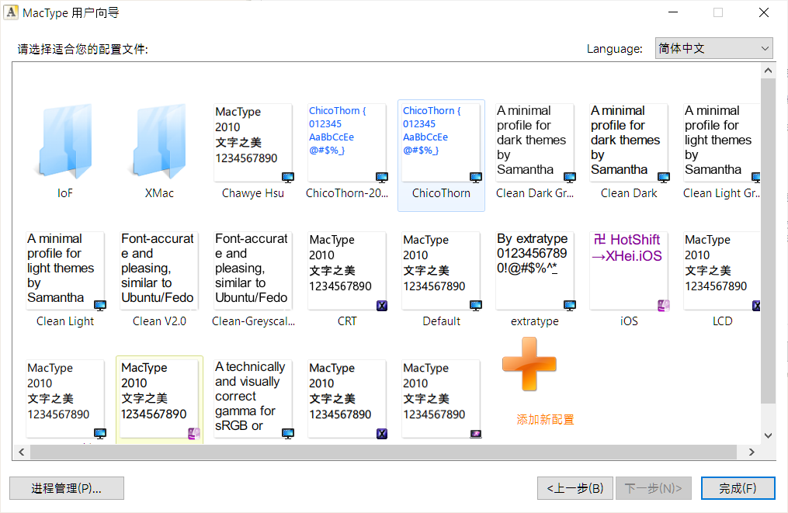

# Windows 终极渲染优化指南

众所周知，Windows 是一座屎山。相同的 PPI 屏幕，Windows 的显示效果是明显不如 Mac 和 Android 的。

经过长期的测试和尝试，我整理出一套针对 Windows 渲染效果的优化方案，能够显著改善显示清晰度和观感，使其更接近 macOS 的视觉体验。

> 需要说明的是，本文主要作为方案的整合与收集，核心技术和功劳应归属于各位原始方案的作者。

---

## 基本知识： Windows 中的两套绘图接口

Windows 并行地存在两套绘图接口:

- GDI（Graphics Device Interface）
- DirectWrite + Direct2D 。

### 一、GDI：传统绘图接口

GDI 是 Windows 自早期版本起就支持的一套基础图形接口，它允许开发者通过简单的 API 实现窗口、按钮、图表等基本图形元素的绘制。GDI 的一大优势在于其广泛的兼容性，几乎可以在所有版本的 Windows 上运行，并且使用起来非常直观。

不过，由于 GDI 主要依赖 CPU 进行图形处理，缺乏硬件加速支持，因此在处理复杂图形、动画效果或高分辨率显示时性能有限。此外，**GDI 的文本渲染质量也相对较弱**，尤其是在小字号或旋转文本场景下，清晰度和可读性不如现代技术。

**使用它来进行绘图的程序开发框架：**

- 传统的 Win32
- MFC 应用程序
- WinForms
- wxWidgets
- JavaFX
- 旧软件

### 二、DirectWrite + Direct2D：现代绘图接口

随着图形需求的不断提升，微软推出了基于 DirectX 技术的 **Direct2D** 和 **DirectWrite** ，它们共同构成了现代 Windows 平台上的 2D 绘图接口。

- **Direct2D** 是一个硬件加速的 2D 图形绘制引擎，能够高效地渲染矢量图形、位图、路径、渐变等多种图形元素；
- **DirectWrite** 则专注于提供高质量的文本渲染，支持 ClearType 技术、子像素精度排版、多语言文字布局等功能，显著提升了文本的清晰度和美观性。

DirectWrite + Direct2D 是现在主流的绘图方案。

**使用它来进行绘图的程序开发框架：** ​

- WPF
- WinUI / UWP
- SkiaSharp
- Chromium / Edge / Chrome/ Electron 浏览器
- QT
- 新软件

---

## 具体操作步骤

### 步骤一：Cleartype

Cleartype 对应优化的绘图接口是 DirectWrite + Direct2D 。

Cleartype 是 Windows 自带的功能，不需要安装任何软件。

想要使用 Cleartype 只需要再 `开始菜单`​ 搜索 `Cleartype`​ 点击打开即可。

​

然后根据提示，一步步选择你**主观**认为最清楚的那个文本即可，非常简单，没有任何参数配置。

​

---

### 步骤二：Mactype

Mactype 是一款由 [snowie2000](https://github.com/snowie2000) 开发，对 GDI 进行重绘的软件。

（现在也能对 DirectWrite 重绘，但有时会有兼容性问题。）

Mactype 可在 Github 页面 [Github snowie2000/mactype](https://github.com/snowie2000/mactype) 中下载。

下载安装后，初次使用软件会弹出加载方式选择的页面。

这里使用 `MacTray 托盘加载`​ + `独立加载模式`​ + `使用管理员权限运行`​ 的加载方式。

​

点击 `下一步 `​ 后，可以看到软件自带的一些预设文件。这些文件可以直接使用。



根据我本人的设备和使用体验来讲，我任务效果比较好的配置文件有：

- Chawye Hsu
- Clear V2.0
- Xmac\Xmac.LCD

老的预设**只能**对 GDI 修改，部分新预设能对 DirectWrite 进行修改。

我配了一套预设，预设仓库在 [Ckrvxr/MactypeINI](https://github.com/Ckrvxr/MactypeINI) 中。

该预设功能包括：（改自 Xmac.LCD）

- GDI 和 DirectWrite 都进行字体渲染优化（重绘）
- 全局常见 Sans （Segou UI 和微软雅黑）字体替换为 Misans。

  - （计算机要安装全局安装 Misans 字体）
  - （推荐的字体还包括 HarmonyOS Sans）
- 丑丑的等宽编程字体（Consolas、Courier New 等）换成 Cascadia Code。
- 始终使用矢量渲染，而非位图。解决 宋体 在字体大小极低的时候变成马赛克的问题。

如果按照默认路径安装，配置文件目录则在目录 `C:\Program Files\MacType\ini`​ 下。

把我的配置文件保存下来，放入目录中就能在配置文件选择时看到。

放到配置文件目录中，在软件中选择使用就**大功告成**啦！

我自己本人的配置也会不定期地进行更新和维护。

#### Mactype 兼容性的问题

使用 Mactype 时，大部分的兼容性问题来自于字体替换功能。原因在于：

- 有的软件会使用字体中非公共区域中的符号，如果代替的字体没有这个符号，或这个符号不对，软件就不能显示字符和部分图标。（经实测， Arial 是绝对不能替换的。）
- 字体替换流程本身的兼容性问题

当遇到乱码或字体不能显示后，第一步就是在配置文件 `.ini`​ 中的 `ExcludeSub`​ 中添加不需要替换字体的进程。

```ini
; ----------- Programs Excluded from Font Replacement ----------------
[ExcludeSub]
; Sysinternals Suite
Autoruns.exe
Autoruns64.exe
procexp.exe
procexp64.exe
Procmon.exe
Procmon64.exe
; Microsoft Office
EXCEL.EXE
POWERPNT.EXE
WINWORD.EXE
; Wallpaper Engine
ui32.exe
; WPS Office
wps.exe
Mihomo Party.exe
MATLAB.exe
...
```

如果对单独进程关闭替换字体不管用，可以尝试对单独经常替换字体也不不渲染。即在配置文件 `.ini`​ 中的 `UnloadDll`​ 中添加不需要加载 DLL 的进程。

```ini
; ----- Programs not Rendered or Replaced Fonts (DLL Not Loaded) -----
[UnloadDll]
; Desktop Window Manager
; dwm.exe
; Windows Subsystem for Linux (WSL)
wslhost.exe
wsl.exe
; Cygwin/MSYS2
gpg.exe
pacman.exe
; Altium Designer
X2.EXE
; Process Lasso
ProcessLasso.exe
```

如果还是不管用，则可以尝试下面的方法：

1. 关闭字体替换功能
2. 关闭对 DirectWrite 加载
3. 关闭实验性的功能 ColorFont 和 ArmBreaker

```ini
; ------------------- Font Loading Configuration -------------------
HookChildProcesses=1
FontLoader=0
FontLink=2
UseMapping=0
MaxHeight=0
MaxBitmap=0
FontSubstitutes=1	; <--- 字体替换功能，1 为开启，0 为关闭
DirectWrite=1		; <--- 是否对 DirectWrite 加载，1 为开启，0 为关闭
```

```ini
[Experimental]
ColorFont=1
ArmBreaker=2
```

具体可参考 [snowie2000/mactype Wiki](https://github.com/snowie2000/mactype/wiki) 和 [Issues · snowie2000/mactype](https://github.com/snowie2000/mactype/issues) 中讨论与解释。

我本人的配置已在多台显示器和设备都是（Windows 10）上迭代了多遍的，基本稳定了，应该是开箱即用的程度。

---

## 别的建议

### 部分老软件渲染模糊的问题

部分老软件渲染模糊，原因在于部分**老软件未更新支持每显示器 DPI 感知（Per-Monitor DPI Awareness）** ，导致系统强制拉伸位图而非矢量重绘，产生了模糊。

解决方法：

1. 右键软件的 exe 文件 → <kbd>属性 </kbd>​→<kbd> 兼容性 </kbd>​→ <kbd>更改高 DPI 设置</kbd>​。
2. 勾选 <kbd>替代高 DPI 缩放行为</kbd>​。
3. 保持执行缩放选择 <kbd>应用程序</kbd>​。
4. ​<kbd>应用</kbd>​后重启软件。
5. 如果效果不理想，可以尝试<kbd>系统</kbd>​、<kbd>系统（增强）</kbd>​。

这个替代缩放的方法只对**少部分**软件能完美重绘。

前后对比：

​

---

### N 卡的视频超分

NVIDIA 的视频超分辨率 (VSR) 功能效果很好，可在提升视频锐度的同时保持画面自然，无明显瑕疵。

**硬件要求**：

- 仅支持 **RTX 30/40 系显卡**（RTX 3050 及以上）
- 驱动程序需 ≥ **551.23 版本**（2024年3月后发布）

**开启步骤：**

1. **打开 NVIDIA App**

    - 桌面右键菜单 → 选择 `NVIDIA App`​
    - 或系统托盘右键点击 NVIDIA 图标 → 打开应用
2. **导航至图形设置**

    - 在应用左侧导航栏 → 点击 **​`设置`​**​ (齿轮图标)
    - 选择 **​`图形`​**​ 选项卡
3. **启用 VSR 功能**

    - 滚动至 **​`视频增强技术`​**​ 区域
    - 找到 **​`RTX 视频增强`​**​ → 开启 **​`超分辨率`​**​ 开关 ✅  
       *（注：部分驱动版本此处显示“VSR”或“视频超分辨率”）*
4. **选择运行模式**

    - 在下方 **​`质量模式`​**​ 下拉菜单中 → 选择 **​`Auto`​**​
5. **保存设置**

    - 关闭设置窗口 → 系统自动应用配置
    - **生效范围**：

      - 支持 Chrome/Edge 浏览器（需重启浏览器）
      - 部分本地播放器（如 MPC-BE/PotPlayer 需开启硬件解码）


#### MS Edge 中视频增强不起作用

如果 Edge 中视频增强不起作用，就把 edge://flags/#edge-video-super-resolution 设置为 Disabled。

没错，关闭就是打开。😇

---

<div>
<div style="display: flex;align-items: center;justify-content: space-evenly;padding-top: 40px;">
  
  
</div>

‍
